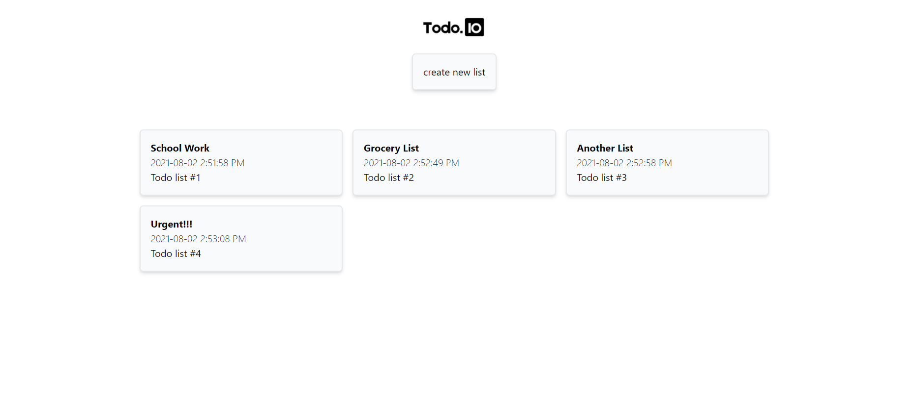
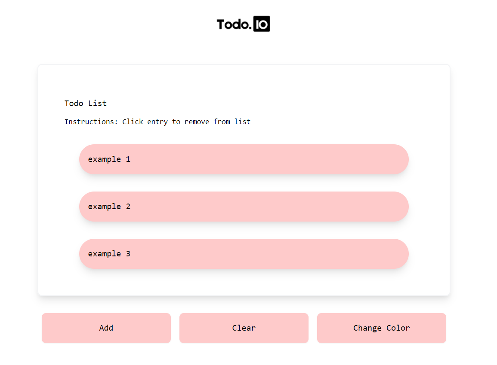

# TodoList

A todo list app created with React.

This project was bootstrapped with [Create React App](https://github.com/facebook/create-react-app). The UI was designed with [React.js](https://reactjs.org/) and styled with [Tailwind CSS](https://tailwindcss.com/). Routing was handled with [React Router](https://reactrouter.com/). You can try the app [here](https://todolistio.netlify.app/).

# Preview
>Dashboard

>Todo List

